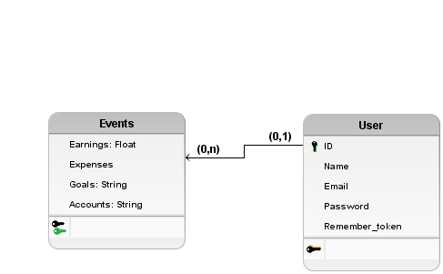

# Financee

## Sobre o app
Financee - seu parceiro financeiro pessoal! Com o Financee, você pode
controlar suas finanças de forma simples e eficiente. Gerencie suas despesas, acompanhe
seus ganhos e nunca mais perca o controle de suas contas a pagar. Com recursos intuitivos
e uma interface amigável, o Financee está aqui para ajudá-lo a alcançar seus objetivos
financeiros. Comece sua jornada rumo à estabilidade financeira com o Financee hoje
mesmo!


## Como rodar o projeto

Primeiramente, se você ainda não tem o Node e Yarn instalados, acompanhe o [tutorial de instalação](https://docs.google.com/document/d/19-0HcZK2Jd_CDPh7jDLcqdaBCVfxMNwam1U8Sbfv5aw/edit).

Clone o repositório atual. Se você não sabe como fazer isso, acompanhe o [tutorial oficial](https://docs.github.com/pt/repositories/creating-and-managing-repositories/cloning-a-repository) do GitHub.

Em um terminal, na pasta do respositório clonado, rode o seguintes comandos:

```bash
$> cd project/

// Se você usa android
$> yarn android

// Se você usa IOS
$> yarn ios
```

## Funcionalidades
- [ ] Autenticação de usuarios
- [ ] Visualização de saldo e despesas
- [ ] Visualização de contas a pagar
- [ ] Visualização de metas financeiras
      
## Protótipos de tela

<a href="https://www.figma.com/file/gZYI7KNy99nHhUy7dvLjUV/Financee?type=design&node-id=0%3A1&mode=design&t=y5fopiUUfHBdoy1T-1" target="_blank">
  Protótipo de Tela
</a>

## Modelagem do banco de dados



## Planejamento
| Atividade | Tempo previsto | Data limite |
| ----------- | ----------- | ----------- |
| Configuração de roteamento     | 3 dias      | 28/04/2024 |
| Instalação e configurações de bibliotecas     | 2 dias      | 28/04/2024 |
| Autenticação de usuario com persistencia no login    | 1 semana      | 26/05/2024 |
| Integração do banco de dados    | 4 dias     | 12/05/2024 |
| Visualização de saldo e despesa    | 1 semana      | 19/05/2024 |
| Visualização de metas    | 1 semana     | 26/05/2024 |
| Visualização de contas    | 1 semana     | 26/05/2024 |

## Atividades
- [x] Configuração React Native Elements
- [x] Configuração Expo Router
- [x] Configuração Native Wind
- [ ] Implementação do layout da área de autenticação (Stack)
- [ ] Implementação da interface estática de login
